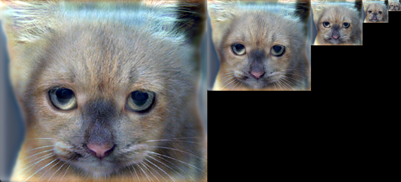
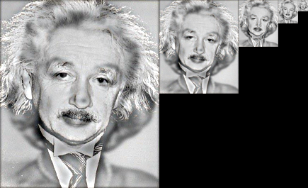
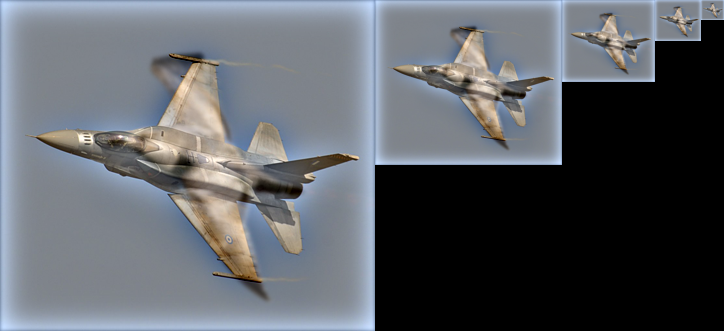

# 🧠 Hybrid Images using Gaussian Filtering

This project implements **hybrid images** using **Gaussian filtering**, inspired by the paper [*Hybrid Images*, by Oliva, Torralba, and Schyns (2006)](https://www.researchgate.net/publication/220184425_Hybrid_images).

> A **hybrid image** is a single image that blends the low-frequency content of one image with the high-frequency content of another.  
> It creates a fascinating visual effect: one image dominates when viewed up close, while another becomes visible from a distance.

---

## 📌 Project Description

This project was developed as part of a course assignment on computer vision.  

The main goal was to gain hands-on experience with image filtering and convolution by reproducing the hybrid image technique.

The implementation is written in **Python**, without relying on external convolution or filtering libraries. 

This allows a deeper understanding of how convolution and Gaussian filters work under the hood.

---

## 🗂️ Files Overview

- `MyConvolution.py`  
  Implements a custom 2D convolution function for both grayscale and RGB images, using zero-padding.

- `MyHybridImages.py`  
  Contains the logic for creating hybrid images by:
  - Applying **low-pass filtering** (Gaussian blur) to one image.
  - Computing the **high-pass** version of a second image.
  - Combining both into a single hybrid image.

- `result_images/`  
  Contains example images showing the effect of hybridization.

---

## ⚙️ How It Works

1. **Gaussian kernels** are generated using a specified standard deviation (`sigma`).  
   The kernel size follows the rule: `floor(8*sigma + 1)` (adjusted to be odd).

2. **Low-pass image** is created by convolving the input image with a Gaussian kernel.

3. **High-pass image** is computed by subtracting a blurred version of the second image from the original.

4. The final **hybrid image** is obtained by adding the low-pass and high-pass components together.

---

## 🖼️ Example Output

1. Combination of low-frequency image of dog and high-frequency of cat:

2. Combination of low-frequency image of Marilyn Monroe and high-frequency of Albert Einstein:

3. Combination of low-frequency image of bird and high-frequency of plane:

---
